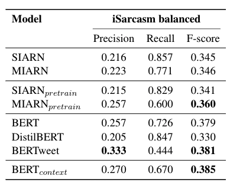

# Contextualized Sarcasm Detection

## Abstract
Sarcasm is a form of irony in which apparent praise conceals another, scornful meaning. Sarcasm is pervasive in social media such as Twitter and Facebook and can be highly disruptive to sentiment analysis and opinion mining systems. Hence, it is indispensable to develop effective models for sarcasm detection. By incorporating contextualized word embeddings and tweet context information into our BERT based sarcasm detection models, we are able to achieve state-of-the-art performance on iSarcasm dataset.

## Result

[See our paper here.](./files/csd.pdf)

